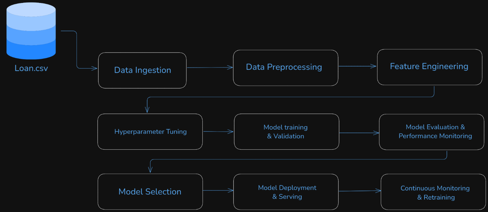

# Loan Risk Model Prediction

This repository contains a complete machine learning pipeline, from data ingestion and preprocessing to model training, evaluation, and deployment using FastAPI. The pipeline also includes unit and integration tests to ensure the robustness of each component.

## Pipeline Diagram



## Project Structure

```
ml_pipeline_project/
│
├── main.py              # Entry point for the FastAPI app (Deployment)
├── pipeline.py          # Contains the main pipeline logic
├── data_ingestion.py    # Handles data ingestion and validation
├── preprocessing.py     # Handles data preprocessing and feature engineering
├── model_training.py    # Handles model building and training
├── model_evaluation.py  # Handles model evaluation and metrics
├── config.py            # Configuration settings and hyperparameters
├── utils.py             # Utility functions (e.g., logging, data checks)
├── tests/               # Directory for unit and integration tests
│   ├── test_pipeline.py
│   ├── test_ingestion.py
│   ├── test_preprocessing.py
│   └── ...
├── requirements.txt     # List of dependencies
├── Dockerfile           # Dockerfile for containerization
└── .github/
    └── workflows/
        └── ci.yml       # GitHub Actions CI/CD pipeline configuration

```


## Setup and Installation

### 1. Clone the Repository

```bash
git clone https://github.com/yourusername/ml_pipeline_project.git
cd ml_pipeline_project
```


### 2. Create and Activate a Virtual Environment
```bash
python -m venv venv
source venv/bin/activate
```
### 3. Install the Dependencies
```bash
pip install -r requirements.txt
```

## Running the Pipeline
To run the machine learning pipeline (including data ingestion, preprocessing, model training, and evaluation), execute the following command:

```bash
python pipeline.py
```
This will preprocess the data, perform hyperparameter tuning, train the model, and save the final model to the models/ directory.

## Running the FastAPI Application (Deployment)
To deploy the FastAPI application for making predictions:

```bash
uvicorn main:app --reload
```
This will start the FastAPI server, which you can access at http://127.0.0.1:8000.


## Available Endpoints
- **/predict**: POST endpoint to make predictions (requires authentication)
- **/health**: GET endpoint for health checks (no authentication required)

### Example Prediction Request

**Important**: The `/predict` endpoint requires authentication via the `X-API-Key` header.

```bash
curl -X POST http://127.0.0.1:8000/predict \
  -H "X-API-Key: demo-key-123456" \
  -H "Content-Type: application/json" \
  -d '{
    "loanAmount": 3000,
    "apr": 199,
    "nPaidOff": 0,
    "isFunded": 1,
    "state": "CA",
    "leadCost": 0,
    "payFrequency": "B",
    "originallyScheduledPaymentAmount": 6395.19
  }'
```

**Response**:
```json
{
  "loanStatus": "Charged Off",
  "riskCategory": "High Risk",
  "confidence": 0.396
}
```


## Security Features

This application includes comprehensive security measures:

- **Input Validation**: Strict Pydantic models with field validation and type checking
- **Authentication**: API key-based authentication for prediction endpoints
- **Data Protection**: Sensitive financial data masking in logs
- **Security Headers**: Comprehensive HTTP security headers (CSP, XSS protection, etc.)
- **Rate Limiting**: Per-IP rate limiting to prevent abuse
- **Request Size Limits**: Protection against large payload attacks
- **File Integrity**: Model file validation before loading
- **Secure Configuration**: Localhost-only binding by default

### Authentication

The `/predict` endpoint requires authentication via the `X-API-Key` header:

```bash
curl -X POST http://127.0.0.1:8000/predict \
  -H "X-API-Key: demo-key-123456" \
  -H "Content-Type: application/json" \
  -d '{"loanAmount": 3000, "apr": 199, ...}'
```

For detailed security information, see [SECURITY_FIXES.md](SECURITY_FIXES.md).

## Running the Tests
To run the unit and integration tests:

```bash
pytest
```

To run security tests specifically:

```bash
python test_security.py
```
